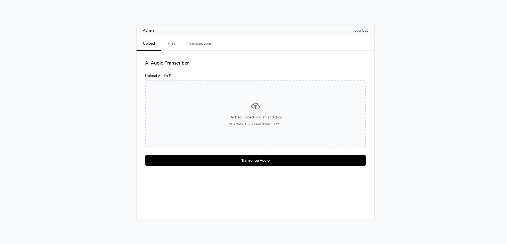
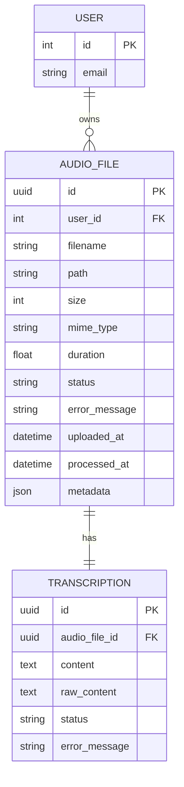

# AI Audio Transcriber

AI Audio Transcriber is a service built with Laravel. It accepts audio files, transcribes them using the OpenAI Whisper API, and removes verbal noise from the text using the ChatGPT API.

## Table of Contents

- [Overview](#overview)
- [Technology Stack](#technology-stack)
- [Prerequisites](#prerequisites)
- [Configuration](#configuration)
- [Installation & Setup](#installation--setup)
- [Running the Application](#running-the-application)
- [Entity Relationship Diagram](#entity-relationship-diagram)
- [Testing](#testing)
- [How to Contribute](#how-to-contribute)
- [License](#license)

## Overview

This is a web application that allows users to upload audio files and receive clean, readable transcriptions.



## Technology Stack

- **Backend**: PHP 8.4+, Laravel 12.*
- **Frontend**: Inertia.js, Vue.js/React
- **Database**: PostgreSQL 15
- **Queue**: Redis
- **Caching**: Redis
- **DevOps**: Docker, Docker Compose
- **External APIs**: OpenAI Whisper API, OpenAI Chat API

## Prerequisites

Before you begin, ensure you have met the following requirements:

- **Docker** (version 20.10 or higher)
- **Docker Compose** (version 2.0 or higher)
- **Git** (version 2.0 or higher)

## Configuration

### Environment Variables

Key environment variables in `.env`:

- `APP_ENV`: Application environment
- `DB_HOST`, `DB_PORT`, `DB_DATABASE`, `DB_USERNAME`, `DB_PASSWORD`: Database connection
- `HTTP_PORT`: Port for the web server
- `REDIS_HOST`, `REDIS_PORT`, `REDIS_PASSWORD`: Redis configuration
- `OPENAI_API_KEY`: OpenAI API key
- `OPENAI_WHISPER_API_URL`: Whisper API endpoint
- `WHISPER_MODEL`: Whisper model
- `OPENAI_CHAT_API_URL`: Chat API endpoint
- `CHAT_MODEL`: Chat model for text cleaning

## Installation & Setup

### 1. Clone the Repository

```bash
git clone https://github.com/yognevoy/ai-audio-transcriber.git
cd ai-audio-transcriber
```

### 2. Copy Environment Configuration

```bash
cp .env.example .env
```

### 3. Build and Start Containers

```bash
docker-compose up -d --build
```

### 4. Install PHP Dependencies

```bash
# Enter the PHP container
docker exec -it ai_audio_transcriber_php bash

# Install dependencies
composer install
```

### 5. Set Up Database

```bash
# From inside the PHP container
php artisan migrate
```

### 6. Build Frontend Assets

```bash
# From inside the PHP container
npm install
npm run build
```

## Running the Application

### Starting Services

```bash
docker-compose up -d
```

### Stopping Services

```bash
docker-compose down
```

### Accessing Services

- **Web Application**: http://localhost:8000
- **PostgreSQL**: localhost:5432 (for external connections)
- **Redis**: localhost:6379 (for external connections)

## Entity Relationship Diagram



## Testing

### Running Tests

```bash
# Run all tests
docker exec -it ai_audio_transcriber_php php artisan test
```

## How to Contribute

If you find a bug or have a feature request, please check the [Issues page](https://github.com/yognevoy/ai-audio-transcriber/issues) before creating a new one. For code contributions, fork the repository, make your changes on a new branch, and submit a pull request with a clear description of the changes. Please make sure to test your changes thoroughly before submitting.

## License
This project is licensed under the MIT License - see the [LICENSE.txt](https://github.com/yognevoy/ai-audio-transcriber/blob/main/LICENSE.txt) file for details.
